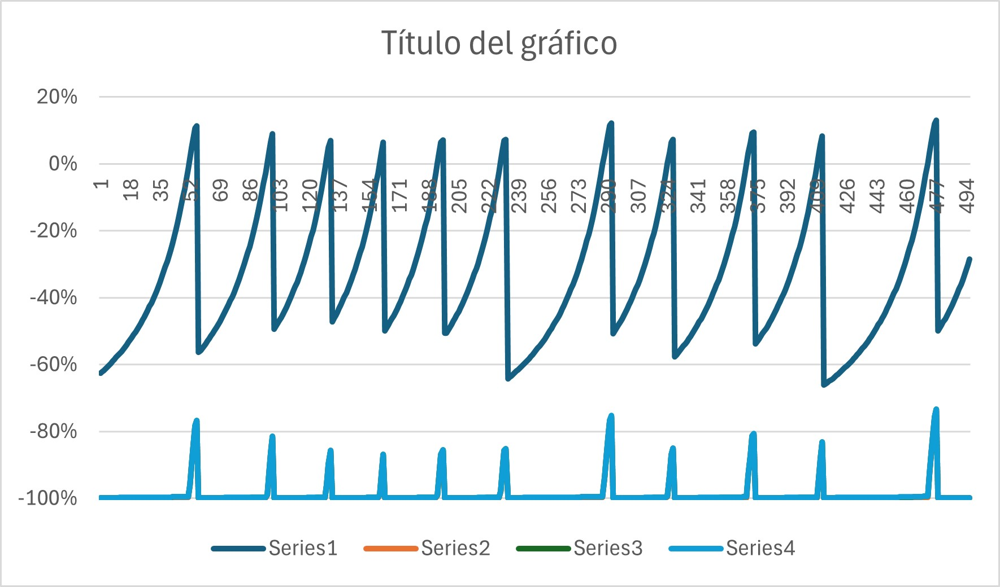

## Analisis del comportamiento de los datos arrojados por el juego de phaser
Para realizar este análisis se tomaron algunos datos dados desde la consola al jugar por un tiempo el videojuego, dandonos algunos de estos datos, los cuales se usaron para gráficarse y revisar su comportamiento.
Dando como resultado el siguiente gráfico:

Donde podemos observar que a simple vista los datos se encuentran mezclados unos con otros dando una impresión de que los datos no se pueden tomar como independientes unos de otros.

### Muestra de algunos de los datos obtenidos en dicha actividad

| Desplazamiento Bala | Velocidad Bala | Estatus | Estatus 2 |
|----------------------|----------------|---------|-----------|
| -650                 | -387           | 1       | 0         |
| -638                 | -387           | 1       | 0         |
| -625                 | -387           | 1       | 0         |
| -612                 | -387           | 1       | 0         |
| -599                 | -387           | 0       | 1         |
| -586                 | -387           | 0       | 1         |
| -573                 | -387           | 0       | 1         |
| -560                 | -387           | 0       | 1         |
| -547                 | -387           | 0       | 1         |
| -534                 | -387           | 0       | 1         |
| -522                 | -387           | 0       | 1         |
| -509                 | -387           | 0       | 1         |
| -496                 | -387           | 0       | 1         |
| -483                 | -387           | 0       | 1         |
| -470                 | -387           | 0       | 1         |
| -457                 | -387           | 0       | 1         |
| -444                 | -387           | 0       | 1         |
| -431                 | -387           | 0       | 1         |
| -418                 | -387           | 0       | 1         |
| -405                 | -387           | 0       | 1         |
| -393                 | -387           | 0       | 1         |
| -380                 | -387           | 0       | 1         |
| -367                 | -387           | 0       | 1         |
| -354                 | -387           | 0       | 1         |
| -341                 | -387           | 0       | 1         |
| -328                 | -387           | 0       | 1         |
| -315                 | -387           | 0       | 1         |
| -302                 | -387           | 0       | 1         |
| -289                 | -387           | 0       | 1         |
| -276                 | -387           | 0       | 1         |
| -264                 | -387           | 0       | 1         |
| -251                 | -387           | 0       | 1         |
| -238                 | -387           | 0       | 1         |
| -225                 | -387           | 0       | 1         |
| -212                 | -387           | 0       | 1         |
| -199                 | -387           | 0       | 1         |
| -186                 | -387           | 0       | 1         |
| -173                 | -387           | 0       | 1         |
| -160                 | -387           | 0       | 1         |
| -147                 | -387           | 0       | 1         |
| -135                 | -387           | 0       | 1         |
| -122                 | -387           | 1       | 0         |
| -109                 | -387           | 1       | 0         |
| -96                  | -387           | 1       | 0         |
| -83                  | -387           | 1       | 0         |
| -70                  | -387           | 1       | 0         |
| -57                  | -387           | 1       | 0         |
| -44                  | -387           | 1       | 0         |
| -31                  | -387           | 1       | 0         |
| -18                  | -387           | 1       | 0         |
| -6                   | -387           | 1       | 0         |
| 7                    | -387           | 1       | 0         |
| 20                   | -387           | 1       | 0         |
| 33                   | -387           | 1       | 0         |
| 46                   | -387           | 1       | 0         |
| 50                   | -387           | 1       | 0         |
